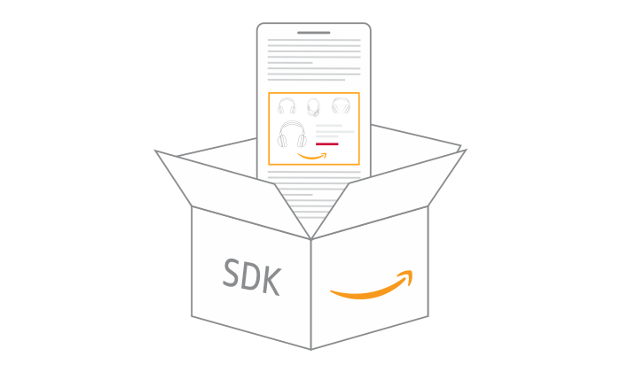

<p align="center">
  <a href="https://github.com/AdversportTeam/react-native-aps/README.md">
    <br/>
  </a>
  <h2 align="center">React Native Amazon Publisher Services</h2>
</p>

<p align="center">
  <a href="https://www.npmjs.com/package/react-native-aps"></a>
  <a href="https://www.npmjs.com/package/react-native-aps"></a>
  <a href="/LICENSE"></a>
</p>

---

**React Native Amazon Publisher Services** allows you to add demand partners via Amazon Publisher Services; a React Native wrapper around the native Amazon Publisher Services SDKs for both iOS and Android.

## Installation

```sh
npm install react-native-aps
cd ios && bundle exec pod install
```

## Usage

### Initializing APS Ads SDK

```js
import APSAds, { AdNetwork, TestIds } from 'react-native-aps';

// ...

APSAds.initialize(TestIds.APS_APP_KEY)
  .then(() => {
    APSAds.setAdNetworkInfo({ adNetwork: AdNetwork.GOOGLE_AD_MANAGER });
    APSAds.setTestMode(true);
  })
```

### Requesting Bid (Key-Value pairs)

Below example shows displaying banner ad with `react-native-google-mobile-ads` library.

```js
import {
  AdLoader,
  AdLoaderOptions,
  AdType,
  isAdError,
  TestIds,
} from 'react-native-aps';
import { BannerAd, BannerAdSize } from 'react-native-google-mobile-ads';

// ...

const apsOptions: AdLoaderOptions = {
  slotUUID: TestIds.APS_SLOT_BANNER,
  type: AdType.BANNER,
  size: '320x50',
};

AdLoader.loadAd(apsOptions)
  .then((result) => {
    setApsBidResult(result);
  })
  .catch((error) => {
    if (isAdError(error)) {
      console.debug(error);
    }
  })
  .finally(() => {
    setApsBidDone(true);
  });

// ...

<View>
  {apsBidDone && (
    <BannerAd
      unitId={TestIds.GAM_BANNER}
      size={BannerAdSize.BANNER}
      requestOptions={{ customTargeting: apsBidResult }}
    />
  )}
</View>
```

## Contributing

See the [contributing guide](CONTRIBUTING.md) to learn how to contribute to the repository and the development workflow.

## License

MIT
