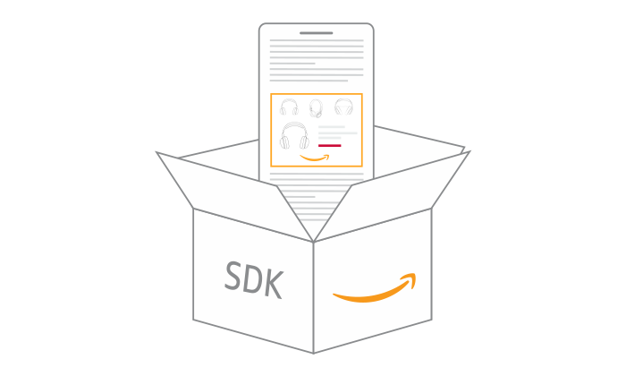

<p align="center">
  <a href="https://github.com/AdversportTeam/react-native-aps/README.md">
    <br/>
  </a>
  <h2 align="center">React Native Amazon Publisher Services</h2>
</p>

<p align="center">
  <a href="https://www.npmjs.com/package/react-native-aps"></a>
  <a href="/LICENSE"></a>
  <a href="https://app.codecov.io/gh/AdversportTeam/react-native-aps/"></a>
</p>

---

**React Native Amazon Publisher Services** allows you to add demand partners via Amazon Publisher Services; a React Native wrapper around the native Amazon Publisher Services SDKs for both iOS and Android.

## Documentation

- [Guides](https://AdversportTeam.github.io/react-native-aps/docs/guides)
- [API Reference](https://AdversportTeam.github.io/react-native-aps/docs/api)

## Content URL (Amazon DSP)

Amazon DSP requires in-app bid requests to carry the public web URL of the
content the user is viewing, so that AmazonAdBot can crawl the page and verify
what surrounds the ad. Inventory it cannot verify progressively loses
eligibility with Amazon advertisers.

Pass it per bid request through `contentUrl`:

```ts
const adLoader = AdLoader.createBannerAdLoader({
  slotUUID: 'your-slot-uuid',
  size: '320x50',
  contentUrl: 'https://yourdomain.com/article/12345',
});
```

The URL must match the in-app content — not a deep link, not a store URL, not
the app home page — and must be publicly reachable. Omit the option entirely
when you have no reliable URL: a missing field is neutral, a wrong one is an
active non-compliance signal.

### Platform support

| Platform | Behaviour |
| --- | --- |
| iOS | Applied through `+[APS setContentUrl:]`, immediately before `loadAd` and inside the same native call. |
| Android | **Ignored.** The Android APS SDK exposes no equivalent. |

Two caveats worth knowing on iOS:

- `+[APS setContentUrl:]` is a class method, so the value is process-global and
  **sticky** — it cannot be cleared, and the last URL set stays attached to
  subsequent requests until another one replaces it.
- The SDK throws an `NSException` in development builds when given an empty or
  nil value, so an empty `contentUrl` is skipped rather than forwarded.

Both the Android gap and the iOS stickiness have been raised with Amazon APS.

## Bid request concurrency (Android)

The APS Android SDK runs every bid request, blocking HTTP call included, on a
single thread: concurrent `loadAd()` calls are answered one after another, in
call order. On a screen with several slots, the last one waits for the sum of
the previous latencies and can miss its render deadline while its answer is
still in the queue.

`initialize` accepts an option that widens the SDK executor before anything
is queued:

```js
await APSAds.initialize(APS_APP_KEY, { bidRequestConcurrency: 3 });
```

- Android only; ignored on iOS, whose SDK does not serialise requests.
- Integer between 1 and 16. Default 1 keeps the SDK behaviour.
- The executor is swapped by reflection, the SDK exposing no API for it. On
  any failure the SDK default is kept and the reason is reported, never thrown.
- Verified against aps-sdk 11.1.1, 12.0.1 and 12.0.2; a JVM unit test in the
  module pins the SDK members it relies on, so a bump that renames them fails
  `./gradlew :react-native-aps:testDebugUnitTest`.

Read back what the SDK really serves, for instance to cap your own scheduling:

```js
const { concurrency, widened, detail } =
  await APSAds.getBidRequestExecutorStatus();
// Android: { concurrency: 3, widened: true } once widened,
//          { concurrency: 1, widened: false, detail: '...' } otherwise.
// iOS:     { concurrency: Infinity, widened: false, detail: '...' }.
```

## Contributing

See the [contributing guide](CONTRIBUTING.md) to learn how to contribute to the repository and the development workflow.

## License

LGPL-3.0
